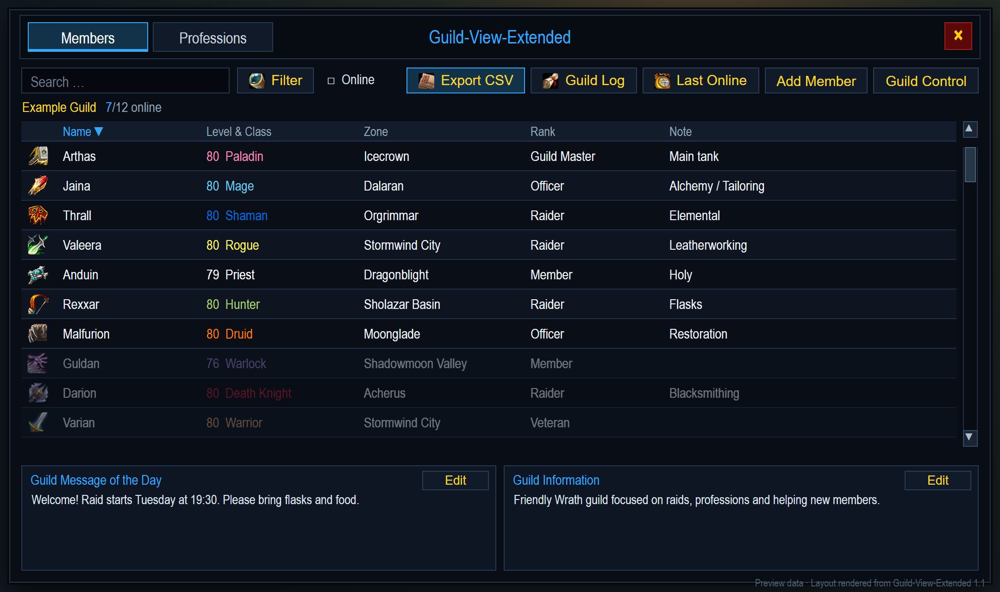
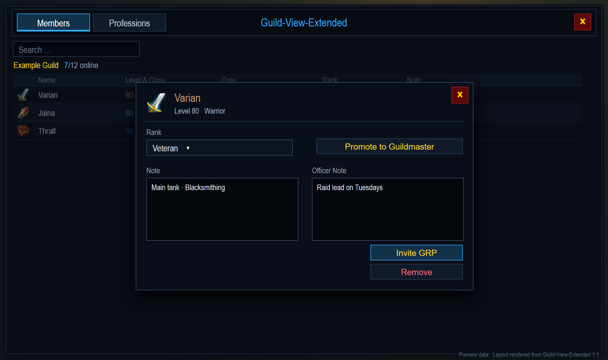
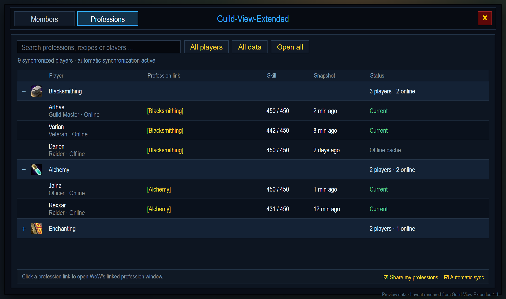

# Guild-View-Extended

Guild-View-Extended replaces the basic guild view with an expanded interface for **World of Warcraft 3.3.5a (build 12340)**.

## Features

- Search the guild roster by name, class, zone, rank, or public note
- Filter members by class, rank, and online status
- Sort the roster using extended columns
- Review last-online information with configurable time filters
- Export all guild character names and guild ranks as a copyable two-column CSV
- Invite a selected guild member directly from the member detail window
- Leave the guild from the player's own roster context menu with confirmation
- Refresh member and guild-note changes automatically while the window is open
- Open member details and supported guild-management actions
- Access guild controls and member invitations when permitted
- View MOTD and Guild Information side by side at a glance
- Open the Guild Log on demand from the member toolbar
- Open synchronized, clickable profession links grouped by profession
- Synchronize profession changes automatically between compatible online guild members
- Detect newer Guild-View-Extended versions from other addon users and show a
  chat notice plus an in-window quest marker with a copyable GitHub release URL

## Screenshots

The screenshots below are deterministic renders of the actual version 1.1
layout using example guild, player, and profession data. They do not show real
guild data.

### Members



### Member details



### Professions




## Requirements

- World of Warcraft client version 3.3.5a
- Interface version `30300`
- A guild membership for roster features

## Version notifications

Guild-View-Extended checks versions through other addon users because a WoW
3.3.5a addon cannot query GitHub over HTTP. It announces its installed version
to compatible guild members and uses a filtered, rate-limited player-created
version channel to discover newer releases from other users on the realm.

When a higher version is detected, the notice appears once in chat and a yellow
quest marker appears beside the close button in GuildView. Clicking the marker
opens an Escape-closeable window containing the official GitHub Releases URL,
already selected for copying with `Ctrl+C`. The addon never attempts to open a
browser or write to the clipboard automatically.

## Installation

1. Download or clone this repository.
2. Copy the `Guild-View-Extended` folder into `Interface/AddOns/`.
3. Confirm the final path is `Interface/AddOns/Guild-View-Extended/Guild-View-Extended.toc`.
4. Restart the client or reload the UI.

## Commands

- `/gve` or `/guildview` opens the extended guild view.
- `/gve log` opens the copyable diagnostic log.

## Member actions and live updates

The compact member table uses original 3.3.5a class icons and displays
**class icon, name, level & class, zone, rank, and public note**. Rows are 32
pixels high so large rosters remain easy to scan without becoming oversized.
The roster scrollbar stays inside the member page. Clicking a member opens a
compact centered detail card rather than a full-height drawer; rank, public
note, officer note, group invitation, removal, and guild-leader transfer keep
their existing permission checks and behavior.

- Left-click a guild member to open the existing member detail window. The
  **Invite GRP** button directly above **Remove** sends an immediate group
  invitation. It is disabled for the player's own character.
- Right-click the player's own character in the roster and choose
  **Gilde verlassen** or **Leave Guild**. A confirmation dialog must be
  accepted before `GuildLeave()` is called.
- While Guild-View-Extended is visible, it requests the complete roster every
  five seconds. The existing `GUILD_ROSTER_UPDATE` path then refreshes members,
  public notes, officer notes, filters, counts, and an open member detail
  window. Offline members remain enabled.

## Last Online window

For guild leaders and officers, the **Last Online** in-window view uses a wider,
three-column layout for character name, guild rank, and last-online time. The
name-or-rank search updates immediately while typing and is combined with the
existing minimum-offline-duration filter. **Clear** resets only the member
search; **Reset** resets only the duration filter. The result count shows the
number of matches alongside the complete roster size.

Changing a search or time filter returns the list to its first row. Escape
closes the window even while the search field has keyboard focus. Opening the
window requests fresh roster data, including offline members.

Version 1.1 identifies itself in the addon list and in the login chat message.
If the message still shows an older version (or no version), the game is loading
a different addon copy. Install the current release ZIP into the active
client's `Interface/AddOns/` directory and use `/reload` before testing.

## CSV export

1. Open Guild-View-Extended with `/gve` or the normal guild shortcut.
2. Click **CSV exportieren** on a German client or **Export CSV** on another
   client in the member toolbar.
3. If the complete roster is not ready yet, the addon requests it and waits for
   `GUILD_ROSTER_UPDATE`. Offline members are included.
4. In the export window, press `Ctrl+C`; the complete text is already selected.
5. Open the Raid Helper web interface, select its character-name CSV import,
   paste the copied text (or save it as a UTF-8 `.csv` file), and start the
   import. Map the `character_name` and `guild_rank` headers if the interface
   asks for column assignments.

The export contains exactly two columns named `character_name` and
`guild_rank`. It does not contain level, class, zone, online state, public
notes, or officer notes. Names are exported without realm suffixes,
deduplicated case-insensitively, and sorted deterministically. The guild rank
from the first retained name entry stays paired with that character. Both
columns use standard CSV escaping. No HTTP request or automatic clipboard
access is used, and no export data is stored in `GVEConfig`.

Example:

```csv
character_name,guild_rank
Arthas,Guild Master
Jaina,Raider
Thrall,Officer
```

## Professions

The **Berufe** / **Professions** tab groups synchronized players by profession.
A player with multiple professions appears in every matching category. Players
without synchronized data remain available in the **Not synchronized** group.

The single search field accepts player and profession names. Professions are
shown as full-width expandable rows with their 3.3.5a spell icon. Expanding a
profession lists every synchronized player with rank, exact clickable WoW
profession hyperlink, skill, snapshot age, and synchronization status. Several
professions can remain open at once; online and snapshot-age filters help keep
large guilds readable.

This is a request-based snapshot system:

- Guild-View-Extended scans the player's own 3.3.5a spellbook and uses the
  second return value of `GetSpellLink()` for each linkable profession. It also
  refreshes immediately when a profession is Shift-clicked from the spellbook.
- The complete client-created hyperlink is retained byte-for-byte. Other guild
  members see one clickable link such as `[Schmiedekunst]`; clicking it opens
  WoW's normal linked-profession window, where the client displays the complete
  profession contents.
- `GetTradeSkillListLink()` remains a guarded fallback while the player's own
  profession window is open.
- Fresh requests require the target player to be online and running a
  compatible Guild-View-Extended version. Offline players show the last cache.
- Compatible clients discover each other automatically after login. Requests
  are queued and rate-limited, and a changed profession link triggers a fresh
  synchronization without requiring a click. **Request data** remains available
  as a manual refresh action.
- Only validated profession links, skill values, and snapshot times are
  transferred. Guild notes and unrelated character data are not.
- Profession sharing is enabled by default and can be disabled with the
  checkbox at the bottom of the tab.

Transfers use the legacy `SendAddonMessage`/`CHAT_MSG_ADDON` APIs, targeted
whispers, throttled chunks, strict size limits, guild-member validation, and an
atomic cache update after a complete transfer. No Retail, Battle.net, HTTP, or
clipboard APIs are used. Cached synchronization data is stored in
`GVESyncData` and is reset on a guild change or after 30 days.

## Guild Control

Saving the stock 3.3.5a Guild Control dialog no longer opens the old guild
window. Guild View suppresses only the `GuildStatus_Update()` call made during
that GVE-owned save operation; Blizzard's permission-saving logic remains
unchanged. Its outer frame follows Guild-View-Extended's flat design while its
original controls remain intact. Guild Control follows the original 3.3.5a
rule and is available to the guild leader.

## Backup and rollback

Before replacing an installed copy, close World of Warcraft and copy the
current `Interface/AddOns/Guild-View-Extended` directory to a safe location.
To roll back, replace the addon directory with that copy and start the client
again. Development backups are intentionally not included in release archives.

## Development tests

From the addon directory, run `lua tests/csv_export_test.lua` with a Lua
5.1-compatible runtime. The test loads the production addon source with small
WoW API stubs and verifies empty, single-member, Unicode, escaping,
deduplication, sorting, 5,000/5,001-member, dialog, Escape, offline-roster, and
asynchronous event cases. It also verifies group invitations, the confirmed
guild-leave action, and the automatic roster refresh timer.

Run `lua tests/sync_snapshot_test.lua` to verify profession serialization,
UTF-8 profession names, authentic 3.3.5a trade links with short owner IDs and
opaque recipe bitmaps, timestamps, and rejection of malformed snapshots.
Both production Lua files and both test files are also parsed explicitly as
Lua 5.1 before a local test package is built.

## Compatibility notes

The addon targets World of Warcraft 3.3.5a build 12340 and uses the legacy
guild, trade-skill, hyperlink, and addon-message APIs available in that client.
It replaces the global guild/friends toggle behavior, so compatibility with
other addons that replace the same interface should be tested. It does not use
Retail guild, club, or Battle.net APIs.

## Privacy

The repository contains addon source only. Do not publish files from `WTF/Account/.../SavedVariables`, because those files may contain account, character, or guild-specific data.

## License and disclaimer

No open-source license is currently granted by this repository. All rights are reserved unless the repository owner states otherwise.

Guild-View-Extended is an independent community addon and is not affiliated with or endorsed by Blizzard Entertainment.
